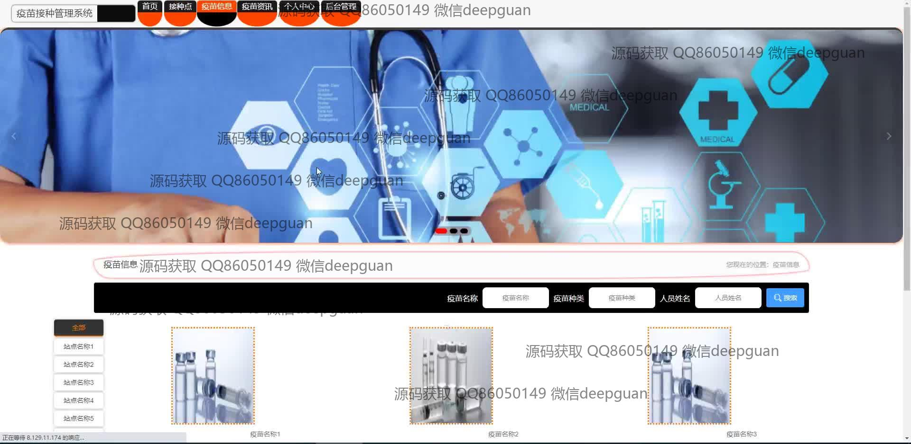
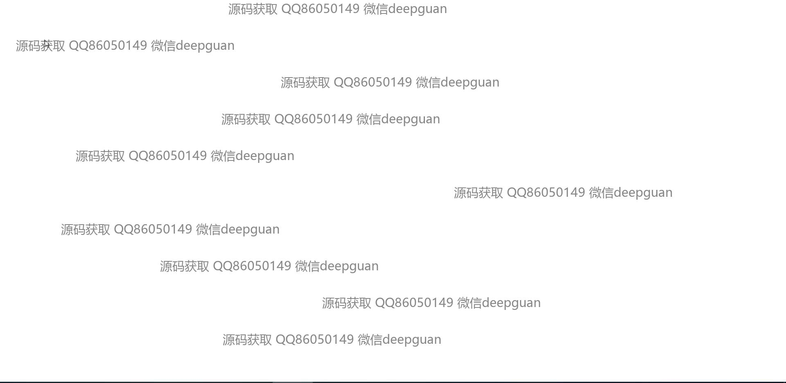
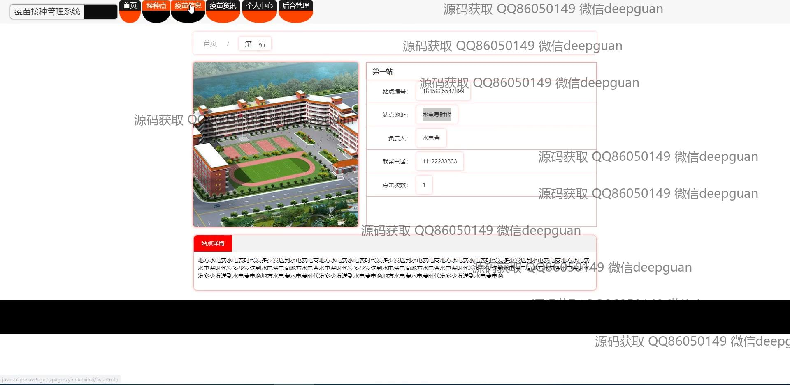

<h1 align="center">疫苗接种管理系统</h1>

## 简介
疫苗接种管理系统：角色分为管理员、用户和工作人员；功能包括用户管理、疫苗信息管理、接种预约管理、接种登记管理和留观登记管理，提高疫苗接种流程的效率和安全性。    --计算机毕业设计源码；毕设源码；java毕业设计源码

## 联系方式

<h3 align="center">获取完整代码与数据库文件 + 微信：deepguan QQ: 86050149 QQ群: 783742310</h3>

<h3 align="center">可帮忙远程部署 包运行成功！提供远程部署、修改代码、设计文档指导、代码讲解等服务！</h3>

## 功能介绍（完整见运行截图）
管理员：登录、注册和退出功能，系统设置和用户管理模块，能够管理疫苗信息、接种点、工作人员信息以及用户信息，审核疫苗预约，查看接种数据统计，调整系统配置，确保系统正常运行并满足公共卫生管理需求。用户：登录、注册和退出功能，个人中心模块便于查看和修改个人信息，能够预约接种疫苗，查询可接种疫苗列表及接种历史记录，获取接种点信息和疫苗资讯，帮助管理和追踪个人及家庭的疫苗接种情况。工作人员：登录和退出功能，管理个人和工作信息可视化，负责接种点的安排和疫苗库存管理，登记接种记录和留观信息，确保疫苗有效分配和接种规范操作，协助管理员执行管理任务，提高疫苗接种流程的效率和安全性。

## 运行截图

本代码来源于网络,仅供学习参考使用!

